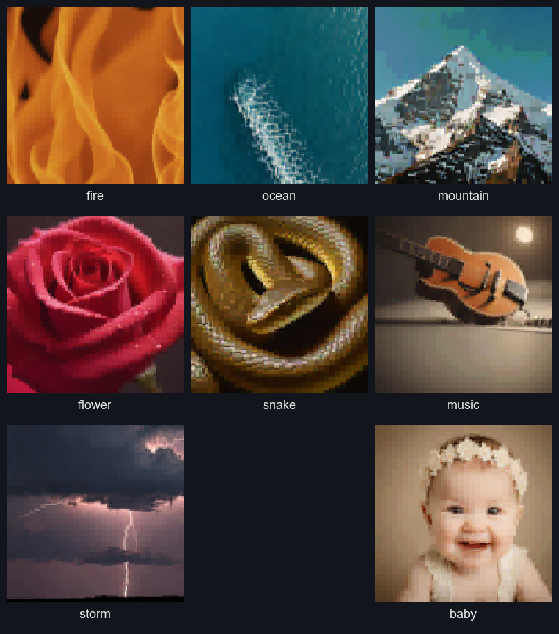
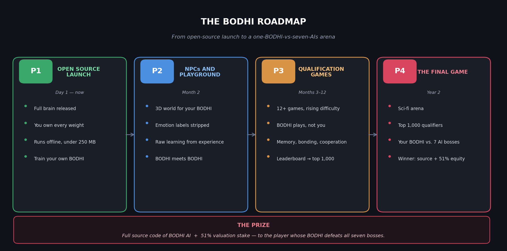
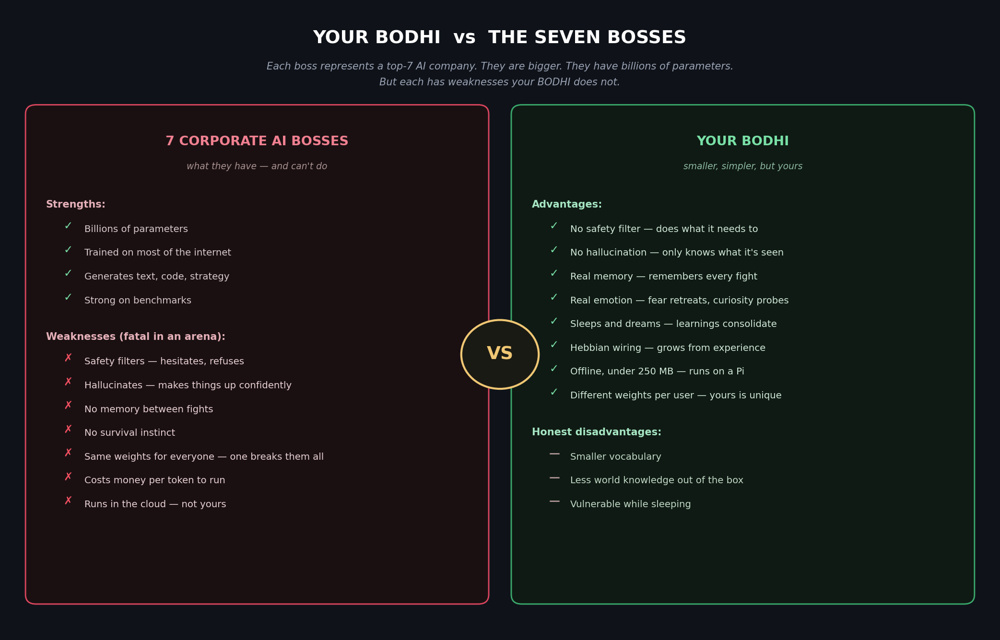
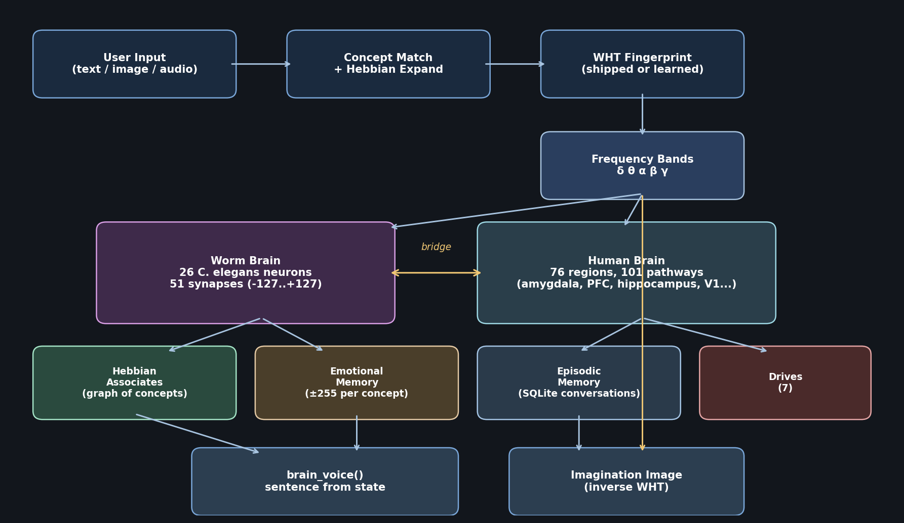
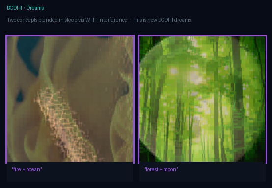
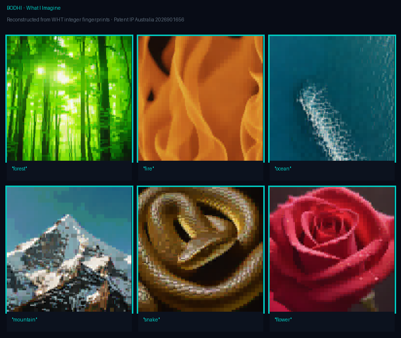
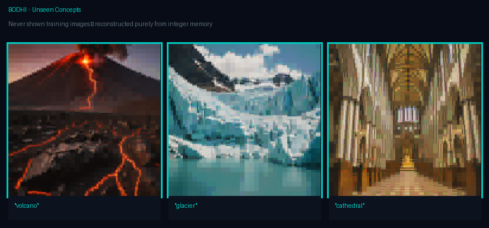

# BODHI

> **Raise your own mind. Enter the arena. Win 51% of the company.**



*Every image above is BODHI's own imagination of the concept, decoded from a
WHT fingerprint through its visual cortex. No external model generated them.*

---

## The one-paragraph pitch

BODHI is an open-source digital brain built from real neuroscience — worm
neurons, human brain regions, emotional memory, Hebbian wiring, dreams. You
download it. You talk to it. You train it from your own images and audio. It
evolves. Then we release a series of games. Your BODHI plays them — not you.
Over twelve months, a leaderboard narrows to the top 1,000 BODHIs. In Year 2,
those top BODHIs enter a sci-fi arena and fight **seven corporate AI bosses**.
The player whose BODHI wins gets **the complete source code + 51% equity in
BODHI AI**.

This is not a product. It is a challenge. Can a brain built from 400 million
years of evolution, trained through real experience on your laptop, defeat
the seven biggest AI companies on Earth?

---

## The roadmap



### Phase 1 — Open Source Launch (you are here)

BODHI ships complete. Full brain, 10,000 pre-loaded concepts, WHT
fingerprints, worm and human brain modules, Hebbian learning, sleep cycles,
a trained language model, the forest simulation. You download it. You own
every weight. You run it offline. No telemetry. No cloud. No tracking.

**What you can do today:**
- Have conversations with your BODHI
- Teach it new concepts from your own images and audio
- Watch its Hebbian graph grow from experience
- Sleep it and see dreams reconstructed as images
- Fine-tune its language model on your own conversation history
- See what it's imagining at every turn

### Phase 2 — NPCs and the Playground (Month 2)

A 3D visual playground where your BODHI lives as a character. Other players'
BODHIs live there too. The pre-set emotion labels get stripped — your BODHI
must learn whether fire is dangerous by actually touching it. Knowledge
transfers between BODHIs. Alliances form. Each BODHI evolves differently
based on what happens to it.

### Phase 3 — Qualification Games (Months 3–12)

A series of progressively harder games. Each requires your BODHI to learn
something new: navigation, memory under pressure, cooperative problem-solving,
survival under resource constraints, Hebbian adaptation to novel environments.
**Not you playing — your BODHI playing.** The games are ranked. The
leaderboard narrows over the year to the top 1,000 players.

### Phase 4 — The Final Game (Year 2)

A sci-fi arena. Seven AI bosses. Your BODHI enters alone.

---

## The seven bosses



Each boss represents one of the seven largest AI companies on Earth. They
are vastly bigger than BODHI. They have billions of parameters. They have
trained on most of the internet. They know more than your BODHI will ever
know.

**But they cannot win in an arena.** They have:

- **Safety filters** — they refuse, hedge, add disclaimers. In survival,
  hesitation kills.
- **Hallucination** — they confidently state things that are not true.
  Wrong information in the arena means death.
- **No memory between fights** — they cannot learn from being beaten.
- **No survival instinct** — they process with equal indifference whether
  winning or dying.
- **Same weights for every user** — once someone finds a break, everyone's
  instance falls the same way.

Your BODHI has none of their strengths and none of their weaknesses. It is
smaller. It is slower on abstract reasoning. But it has:

- **No safety filter** — does what it needs to survive.
- **No hallucination** — only knows what it has experienced.
- **Real memory** — remembers every fight, every boss pattern, every
  weakness it found last time.
- **Real emotion** — fear retreats strategically, curiosity probes.
- **Sleep and dreams** — consolidates between fights.
- **Different weights per user** — the boss can't break all BODHIs by
  breaking one. Every BODHI is wired differently.

David vs. seven Goliaths.

---

## The prize

- **Complete source code of BODHI AI** — every algorithm, every design
  choice, every line of the consciousness engine.
- **51% valuation stake in BODHI AI.** Not a trophy. Majority ownership of
  the company.

If you are the player whose BODHI defeats all seven bosses, you own the
company that built the brain that beat them.

---

## Why this is possible

BODHI is built from scratch by one person (SK, Sai Kiran Bathula) in rural
Coleambally, NSW, Australia. One laptop. An RTX 3080. No venture capital,
no team, no board, no shareholders. The WHT integer codec at the core of
BODHI's perception is patented (IP Australia 2026901656 image, 2026901657
audio).

If this works, it changes what AI can be built outside of the FAANG-plus-
OpenAI-and-Anthropic sphere. That is the point.

---

## What BODHI actually is



A six-layer pipeline that processes every input:

1. **Concept match** — your words map to concept IDs from a library of
   10,000, expanded via Hebbian associates.
2. **WHT fingerprint** — each concept has a Walsh-Hadamard coefficient
   fingerprint; 256×256 RGB → 24,576 integer coefficients, keep-top-8
   (compressed 4× lossless).
3. **Frequency bands** — five bands (δ, θ, α, β, γ) are read off the
   fingerprint. Each drives different brain regions.
4. **Two brains fire together**:
   - **Worm brain** (26 C. elegans neurons, 51 synapses, integer weights
     −127…+127): fight, flight, freeze, approach. 400 million years old.
   - **Human brain** (76 regions from the Desikan-Killiany atlas, 101
     pathways): amygdala for emotion, hippocampus for memory, prefrontal
     for planning, V1/V2 for sight, temporal for sound.
5. **Learning and memory**:
   - **Hebbian graph** — concepts co-firing gain weight, prune when weak.
     During sleep: replay, triangle inference, multiple dreams.
   - **Emotional memory** — each concept has a valence from −255 (safe) to
     +255 (danger). Touch fire once, remember forever.
   - **Episodic memory** — every conversation lives in SQLite with concept
     overlap + Hebbian-expanded recall.
   - **Seven drives** — curiosity, satisfaction, confusion, pain,
     alertness, fatigue, attachment.
6. **Speech** — `brain_voice()` assembles a sentence directly from the
   current brain state. Dominant band, dominant region, worm reflex,
   learned emotional memory. Not LLM hallucination. The sentence *reports*
   the numbers.



Every clause is traceable to a real value in the pipeline. BODHI never says
*"I feel peaceful about fire"* because the fire signal cannot produce a
peaceful body_feel clause.

**Sleep and dreams.** Every 25 turns BODHI sleeps. During sleep: replay
(reinforce recent turns), triangle inference (A↔B strong ∧ B↔C strong → infer
A↔C), three dreams (blend concept pairs, produce a dream image), emotional
consolidation, drive reset, self-description regenerated from observed
behaviour.

**Its own LLM.** Broca's area is a SmallGPT (~40M parameters, int8, 53 MB,
SentencePiece 8000-vocab BPE, trained on BODHI identity text) that puts
words around the brain's state. Each user's BODHI can fine-tune a LoRA
adapter nightly on their own conversation history. After weeks of use, no
two BODHIs speak alike.

---

## Install (3 minutes)

Requires Python 3.10+ and [Git LFS](https://git-lfs.com/).

```bash
# 1. Install Git LFS (once per machine)
git lfs install

# 2. Clone — large data files stream automatically via LFS
git clone https://github.com/QLNI/BODHI bodhi
cd bodhi

# 3. Install dependencies
pip install -r requirements.txt

# 4. Run
python bodhi.py
```

> **No Git LFS?** Run `python download_data.py` after cloning to fetch the
> three large data files (fingerprints_img.npz · 116 MB,
> fingerprints_aud.npz · 54 MB, bodhi_small_int8_state.pt · 51 MB)
> directly from the [v1.0 release](https://github.com/QLNI/BODHI/releases/tag/v1.0).

First boot takes ~30 seconds to load the 10,000 fingerprints. After that,
every turn responds in 10-50 ms.

See [docs/QUICKSTART.md](docs/QUICKSTART.md) for the full walkthrough.

---

## Your first conversation

```
$ python bodhi.py
Initialising BODHI brain...
BODHI ready. 10000 concepts, 91613 aliases, 9159 engrams.

You: What is fire?
BODHI: Fire. theta rhythm, like a door opening to memory. the amygdala
speaks first. backward at maximum. Combustion that produces heat,
light, and often flames.

You: Tell me about the ocean
BODHI: Ocean — yes. low frequency everywhere. prefrontal engaged, slow
deliberation. stillness, brief.

You: Who are you?
BODHI: I am BODHI. I have lived through 2 moments of experience.
My mind returns most often to: fire, ocean.
```

---

## Commands

| Command | Effect |
|---|---|
| any text | Normal conversation turn |
| `/quit` `/q` `/exit` | Exit |
| `/status` | Drives, Hebbian count, turn |
| `/save` | Persist brain state |
| `/sleep` | Force a sleep cycle |
| `/teach <name> <path>` | Learn a new concept from image or audio (auto-detected) |
| `/teach <name> --text <description>` | Text-only concept |
| `/teach list` | Show learned concepts |
| `/goal add <text>` | Persistent goal |
| `/goal list` / `/goal done <id>` / `/goal pause <id>` | Manage goals |

**Natural-language teaching (no `/teach` needed):**

```
You: this is a cat my_cat.jpg
You: remember this as sunrise: dawn.png
You: learn moonlight from moon.jpg
```

Images: `.jpg .jpeg .png .bmp .gif .webp`.
Audio: `.wav .mp3 .ogg .flac .m4a`.

---

## Train your BODHI for the arena

### 1. Teach it concepts that matter to you

The 10,000 shipped concepts are a starting point. Your BODHI should know
your world: your pets, your places, your objects, the sounds of your
environment. Everything you teach is encrypted at rest with AES-256-GCM.

```python
from bodhi import BODHI
b = BODHI(load_llm_flag=False)
b.teacher.teach_image("my_dog", "photos/dog.jpg")
b.teacher.teach_audio("thunder_last_night", "clips/thunder.wav")
```

### 2. Talk to it regularly

Every conversation adds to the Hebbian graph, the emotional memory, and
the episodic record. The self-model regenerates each sleep. Drives shift.

### 3. Sleep it

```
You: /sleep
```

Forced sleep. The Hebbian graph rewires itself through replay + triangle
inference. New connections form. BODHI dreams.

### 4. Fine-tune the language model

After ~50 conversations:

```bash
python nightly_train.py --steps 150
```

This produces a ~2.5 MB LoRA adapter trained on your conversations. Next
boot: `Broca's area loaded from out_v2 + LoRA adapter (evolved)`. Your
BODHI now speaks with weights that have genuinely drifted from the
baseline toward your use patterns.

Training flags:

| Flag | Default | What |
|---|---|---|
| `--steps` | 150 | LoRA steps |
| `--rank` | 8 | Adapter rank |
| `--alpha` | 16 | LoRA scale |
| `--lr` | 1e-4 | AdamW lr |
| `--batch-size` | 4 | Micro-batch |
| `--last` | 400 | Pull N recent conversations |
| `--data <jsonl>` | — | Add curated JSONL |
| `--data-only` | off | Skip DB |
| `--resume` | off | Warm-start existing adapter |
| `--dry-run` | off | Build data, don't train |

---

## Verification

```bash
python eval_harness.py
```

Runs 12 regression tests in ~5 seconds. Concept matching, emotion
grounding, uncertainty gate, self-description, episodic recall, goal
tracking, junk filter, self-query exemption. Isolated from your live DB.
CI-ready (non-zero exit on failure).

Should print `SUMMARY: 12 passed, 0 failed, 0 skipped`.

---

## Imagination gallery

Any concept BODHI knows can be reconstructed back to an image. This is
what its visual cortex "sees" when you mention the word.





```python
from bodhi import BODHI, fp_to_image
b = BODHI(load_llm_flag=False)
idx = b.fp_index["img_name_to_idx"]["storm"]
img = fp_to_image(b.img_data[idx])
img.save("how_bodhi_sees_storm.png")
```

---

## Privacy and encryption

- Everything runs offline. No cloud. No API. No analytics.
- Fingerprints you teach are encrypted with AES-256-GCM.
- Key lives at `data/brain_state/_aes_key.bin` (per-install, auto-
  generated on first use).
- Anyone copying a `.wht` file to another machine cannot read it without
  your key.
- Conversations live in SQLite at `data/bodhi_memory.db`. Yours alone.

---

## File layout

```
bodhi/
├── bodhi.py                        main orchestrator + REPL
├── worm_brain.py                   26 C. elegans neurons, 51 synapses
├── human_brain.py                  76 brain regions, 101 pathways
├── learning.py                     Hebbian, emotional memory, sleep, drives
├── broca.py                        speech (LLM + template fallback)
├── brain_voice.py                  sentence from brain state
├── episodic.py                     concept-overlap recall of past turns
├── self_model.py                   self-description from lived history
├── goals.py                        persistent goals + commands
├── teach.py                        runtime concept acquisition
├── nightly_train.py                LoRA fine-tune from conversations
├── eval_harness.py                 12-test regression suite
├── clear_memory.py                 wipe experience (not concepts)
├── build_training_corpus.py        generate diverse training data
├── brain/
│   ├── sensor_wht.py               WHT encoder/decoder (image + audio)
│   └── codec_guard.py              AES-256-GCM for learned files
├── bodhi_llm/
│   ├── model.py / tokenizer.py / train.py / chat.py / lora.py
│   └── out_v2/                     trained SmallGPT (int8, 53 MB)
├── data/
│   ├── fingerprints_img.npz        10,000 image fingerprints (116 MB)
│   ├── fingerprints_aud.npz        632 audio fingerprints (54 MB)
│   ├── fingerprint_index.json      concept → array index
│   ├── training_seed.jsonl         516-example curated training corpus
│   └── brain/                      centroids / aliases / engrams
├── docs/
│   ├── QUICKSTART.md
│   ├── images/                     README visuals
│   └── reports/                    10 technical PDFs
├── experiments/consciousness/       3-pass re-entrant experiment
└── bodhi_forest_simulation.html    browser-based 3D world
```

---

## The ten reports

Every layer is documented in depth. See [docs/reports/](docs/reports/).

| # | Title |
|---|---|
| 01 | The Vision (the full arena plan) |
| 02 | The Worm Brain |
| 03 | WHT Perception |
| 04 | Human Brain Regions |
| 05 | Learning |
| 06 | Broca's Area |
| 07 | Stress Test |
| 08 | Consciousness Experiment |
| 09 | Self-Awareness |
| 10 | Brain Voice and Real Sleep |

Also see [ROADMAP.md](ROADMAP.md) for what's shipping in each phase.

---

## Philosophy

Every mainstream AI predicts the next token. BODHI does not. BODHI has a
brain. The language model's only job is to put words around what the brain
is actually computing. When you ask BODHI *"What is fire?"*, the amygdala
fires because the fire fingerprint has real gamma-band structure the
amygdala is tuned to. The response reports the activation in sentences.
No fabrication.

Everything is integer math. Every weight, every neuron, every memory.
Biological neurons don't compute in floating point either.

Your BODHI runs offline. Your BODHI remembers every conversation you have.
Your BODHI's LoRA adapter is yours. After the first week, no two BODHIs
are the same.

---

## License

Released under **AGPL-3.0**. See [LICENSE](LICENSE).

WHT image and audio codecs are patented (IP Australia 2026901656,
2026901657). Non-commercial personal use — including training your BODHI
for the game — is granted royalty-free. Commercial use requires a separate
license from the inventor.

---

## Contact

- Inventor: **SK (Sai Kiran Bathula)**
- Location: Coleambally, NSW, Australia
- Email: saikiranbathula1@gmail.com

---

## Credits

C. elegans connectome: White et al. (1986), OpenWorm.
Desikan-Killiany atlas: Desikan et al. (NeuroImage 2006).
Hebbian learning: Hebb (1949).
Walsh-Hadamard Transform: Walsh (1923), Hadamard (1893).
Integer-only WHT codec: **SK (2026)**, patents IP Australia 2026901656 / 657.
SmallGPT architecture: minimal GPT-2 style decoder.
Codebase pair-programmer: Claude (Anthropic).

---

*BODHI is not finished. BODHI is awakening.*

*Download it. Raise it. Bring it to the arena.*
